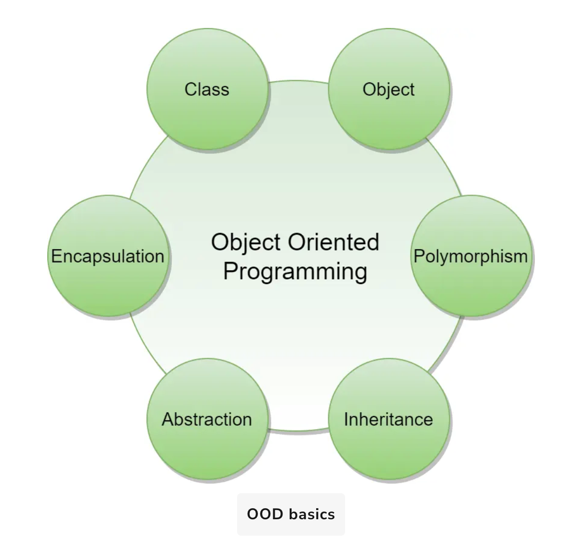

# Object-Oriented Basics

Object-oriented programming (OOP) is a style of programming that focuses on using objects to design and build applications. Contrary to procedure-oriented programming where programs are designed as blocks of statements to manipulate data, OOP organizes the program to combine data and functionality and wrap it inside something called an "Object".

If you have never used an object-oriented programming language before, you will need to learn a few basic concepts before you can begin writing any code. This chapter will introduce some basic concepts of OOP:

## Key Concepts

### Objects

Objects represent a real-world entity and are the basic building blocks of OOP.  
**Example:** In an Online Shopping System, objects might include:

- Shopping cart
- Customer
- Product item

### Class

A class is the prototype or blueprint of an object. It defines the attributes and methods of the object.  
**Example:** In the Online Shopping System, the `Customer` class might include:

- **Attributes:** shipping address, credit card
- **Methods:** place order, cancel order

## OOD Basics

The four principles of object-oriented programming are:

### 1. Encapsulation

Encapsulation is the mechanism of binding data together and hiding it from the outside world.  
Each object keeps its state private, accessible only through public methods.

### 2. Abstraction

Abstraction hides all but the relevant data of an object, reducing system complexity.  
It focuses on what an object does rather than how it does it.

### 3. Inheritance

Inheritance allows creation of new classes from existing ones, promoting code reuse.

### 4. Polymorphism

Polymorphism (Greek: “many forms”) allows objects to respond to the same message in different ways.  
**Example:** In a chess game, pieces like bishop, castle, or knight all respond differently to the `move` message.
