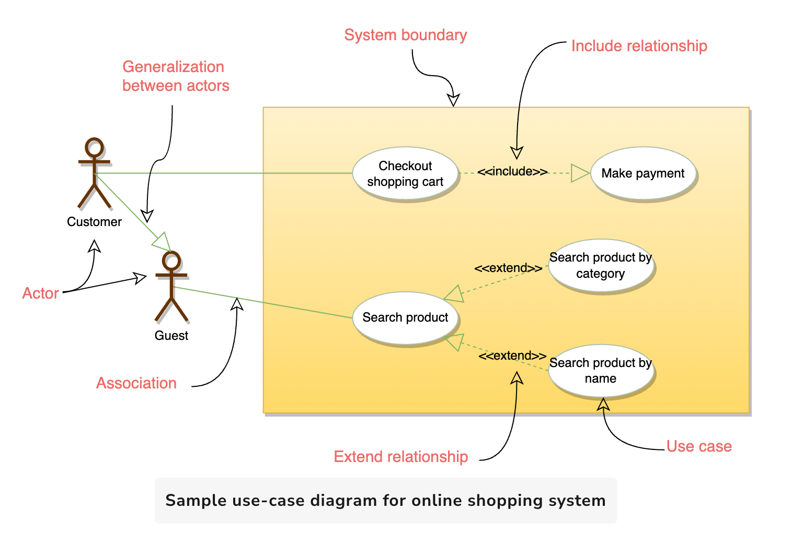

# Use Case Diagrams

Use case diagrams describe a set of actions (called **use cases**) that a system should or can perform in collaboration with one or more external users (called **actors**). Each use case should provide some observable and valuable result to the actors.

## Purpose of Use Case Diagrams

- Describes the **high-level functional behavior** of the system
- Answers **what the system does** from the user’s point of view
- Clarifies both **what the system will do** and **what it will NOT do**
- Visualizes **functional requirements**, relationships between **actors** and **use cases**, and interactions among use cases

## Diagram Notation

- **Use Case**: Represented as an **oval** with the use case name centered inside
- **Actor**: Represented as a **stick figure**, typically placed on the left or right of the diagram
- **System Boundary**: Represented by a **rectangle** that encompasses all use cases

> Example: Sample use-case diagram for an Online Shopping System  
> 

## Key Components

### 1. System Boundary

Defines the **scope** and **limits** of the system. All use cases reside within this boundary.

### 2. Actors

Entities (users or other systems) that perform actions in the system.  
**Example:** In a banking system, a `Customer` is an actor.

### 3. Use Case

Represents a specific business functionality.  
Each use case corresponds to a discrete function listed in the problem statement.

### 4. Include

An **include** relationship shows that one use case **invokes** another.  
_Analogous to one function calling another._

### 5. Extend

An **extend** relationship adds new steps or behavior to a base use case, while still preserving its core functionality.
